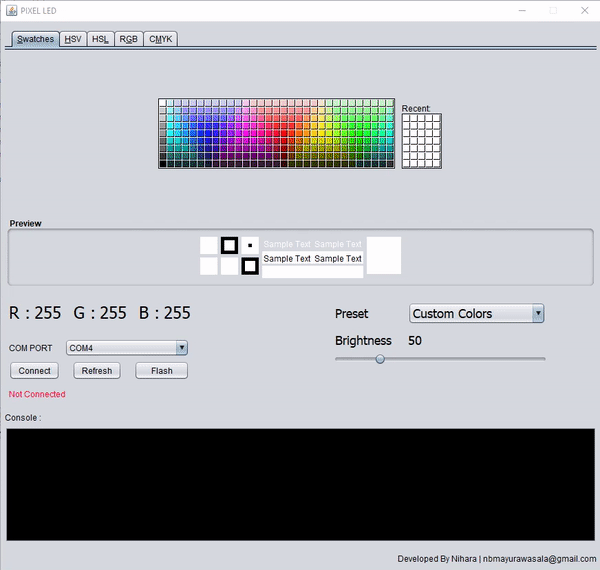

### description

NEO Pixel LED color chooser  

This project is designed for neo pixel led stripe. using this java application and arduino UNO 
you can send RGB values to neo pixel stripe in Custom Color mode. application has multiple color pattern modes. 

### Features

- Choose custom color
- Multiple Patterns

### Setup

Get the code.

 <pre>git clone https://github.com/ubaimutl/react-portfolio.git</pre>
 
Copy Arduino CLI and config

### Thanks
If you like this project don't forget give it a ⭐ 
 

